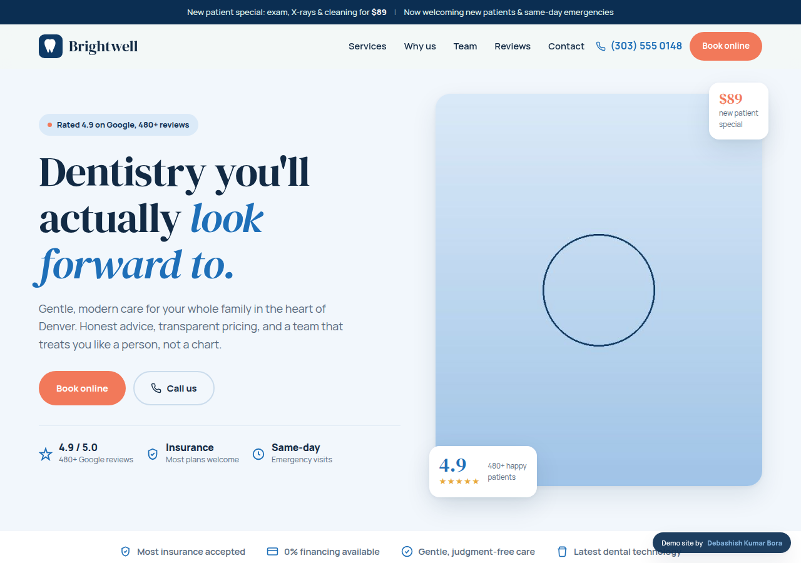
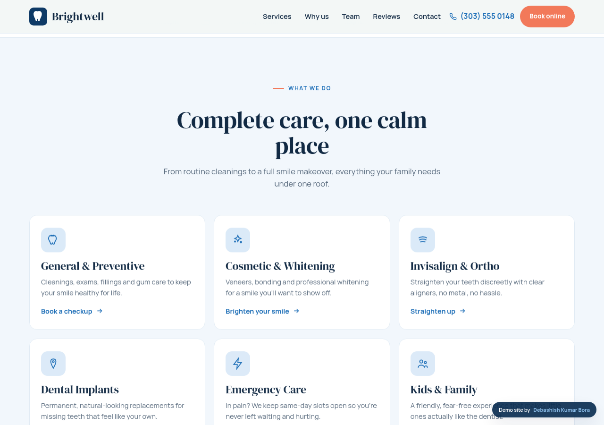
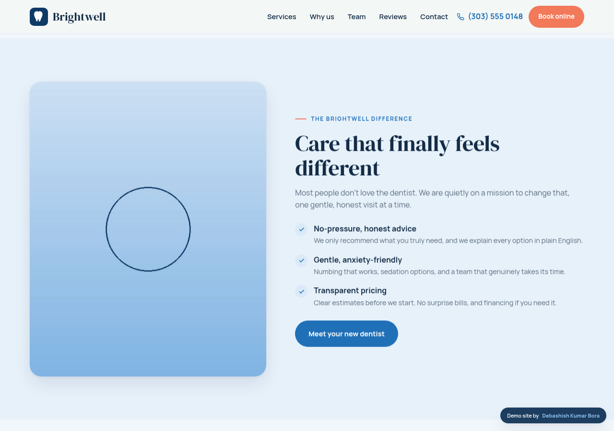
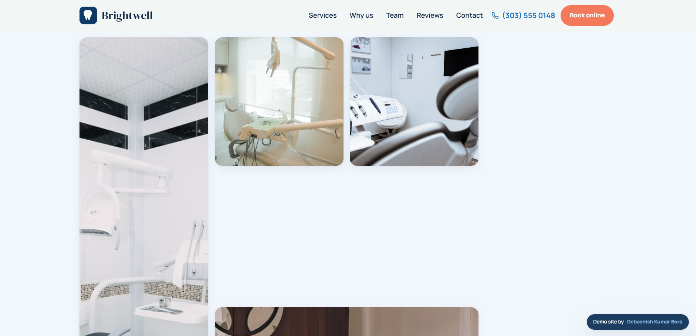
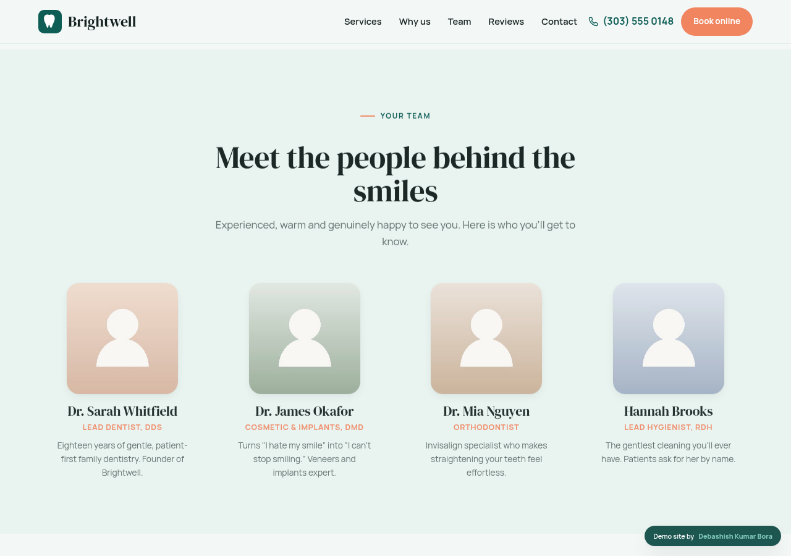
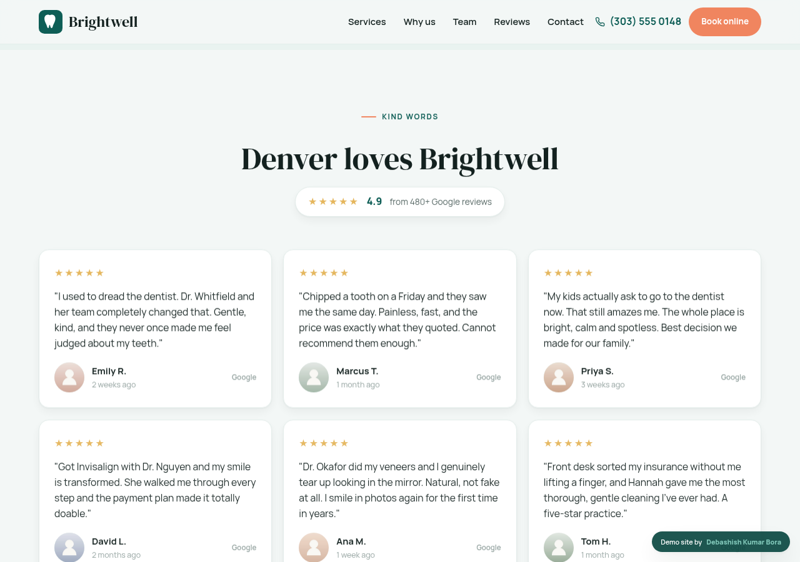
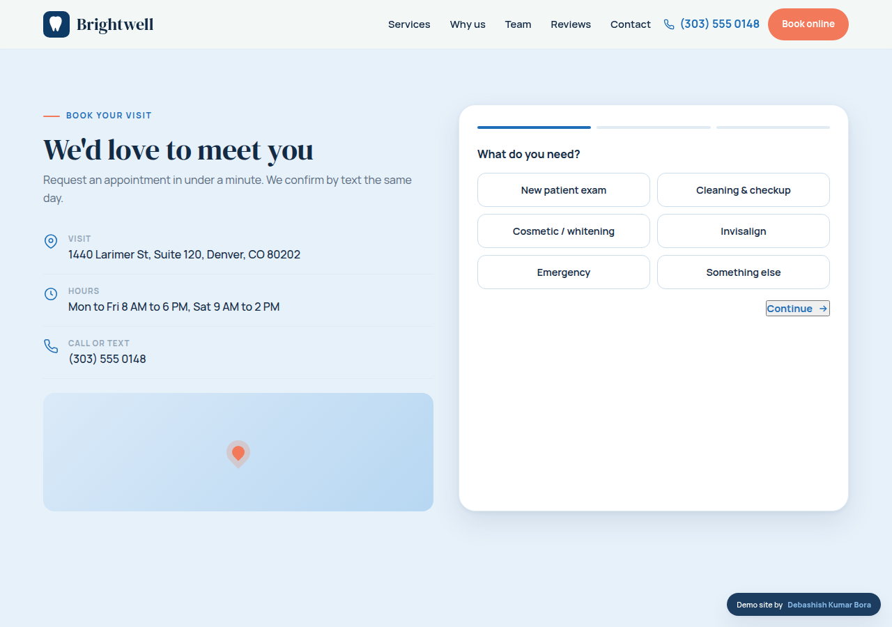
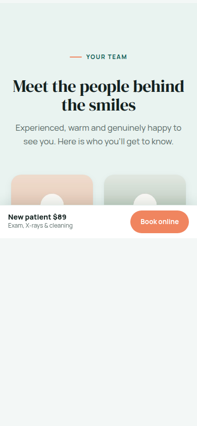

# Brightwell Dental, a premium dental practice website

A modern, conversion-focused website for a family and cosmetic dental practice. Built as a flagship portfolio piece *and* a template you can rebrand and resell to real dentists. **Brightwell** is a fictional practice created for the demo.

Dentists are one of the best web design niches: a new patient is worth $1,000+ up front and $10,000 to $20,000 over their lifetime, so a strong site pays for itself fast, and they understand marketing spend. The hook that sells a redesign is simple: "book online" plus trust. This site is built around both.

## This one has real photography

Unlike a bare template, this site is designed to *feel* like a real, photographed practice:

- **Real human faces in the reviews** (patient portraits), so the social proof feels genuine, not generic.
- **Real team headshots** for the dentists and hygienist.
- **Warm ambiance photos** of the practice (reception, treatment rooms) so it feels like a place you'd actually walk into.

All images use **free, commercial-license stock** (real portraits via randomuser.me, dental interiors via Pexels, both free with no attribution required), loaded from their CDNs. Every image also has a soft gradient fallback and hides itself gracefully if a URL ever fails, so the site never looks broken.

> Note on the screenshots in this folder: they use placeholder blocks because the preview was rendered in an offline build environment. **The real photos load automatically** the moment you open `index.html` in a browser or host it. Swap in the client's own photos to make it truly theirs.

## What's inside

- **Announcement bar** with the new-patient offer, and a sticky top nav with a phone number and a bright "Book online" call to action.
- **Hero** with trust signals (Google rating, insurance, same-day emergencies), floating rating and offer cards.
- **Services grid** (general, cosmetic, Invisalign, implants, emergency, kids).
- **The Brightwell difference** section: honest advice, gentle care, transparent pricing.

- **Practice gallery** of real ambiance photos.

- **Meet the team** with photos, roles and warm bios.

- **Reviews** with real patient faces, star ratings and a 4.9 Google aggregate.

- **New patient $89 offer band**, a big conversion moment.
- **Multi-step booking flow** (service, timing, contact) with a friendly confirmation, plus address, hours and a map placeholder.

- **FAQ** that answers the real objections (insurance, first visit, nervous patients, emergencies, financing), a **sticky mobile book bar**, and full mobile layout.

## Make it a client's site in about 30 minutes

1. **Rebrand:** find-and-replace "Brightwell", update the address, phone, hours, and the announcement offer.
2. **Recolor:** change a handful of CSS variables at the top (`--teal`, `--mint`, `--coral`) and the whole site re-themes.
3. **Swap the photos:** replace the image URLs with the client's real team headshots, office photos, and (with permission) patient smiles. Keep sizes similar.
4. **Real reviews:** paste the client's actual Google review text and reviewer names.
5. **Wire the booking form** to their email, booking system, or a Calendly link. This is where your local, Google Business Profile, and Google Ads skills upsell naturally: you're selling booked patients, not just a website.
6. Remove the "Demo site by" badge for the live version.

## Tech

Single HTML file. Inline CSS and JavaScript, no frameworks, no build, no backend. Images are free-license stock loaded from their CDNs (the only external dependency). Fonts: DM Serif Display + Manrope. Mobile-first, verified zero horizontal overflow from 360px to 1440px, no JavaScript errors.

---

Built by **Debashish Kumar Bora**
Portfolio: https://debashishkumarbora.github.io
Email: debashishbora30@gmail.com
